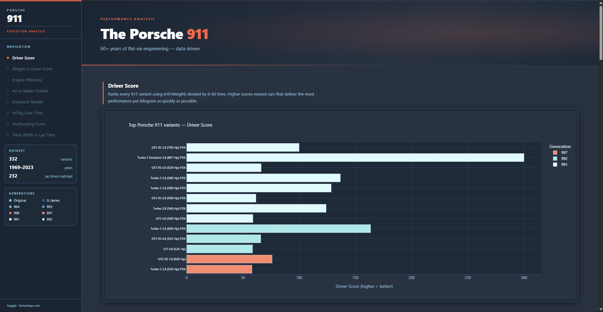
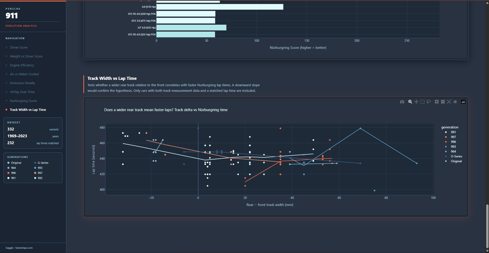

# Porsche 911 Evolution Analysis

An interactive data dashboard exploring 60+ years of Porsche 911 engineering, built with Python and Plotly.

**[View Live Demo →](https://agarantche.github.io/Porsche-data-analysis/)**



## What It Does

Loads a dataset of ~290 Porsche 911 variants from Kaggle, scrapes live Nürburgring lap times from fastestlaps.com, and generates a single-page interactive dashboard with 8 charts covering performance, efficiency, and engineering evolution across every generation from the original 1969 model to the modern 992.

## Features

- **Driver Score** — ranks every variant using (HP/Weight) ÷ 0–60 time
- **Weight vs. Performance** — sweet spot analysis across generations
- **Engine Efficiency** — HP/litre trends by generation
- **Air-Cooled vs. Water-Cooled** — comparison across the 1999 transition
- **1970s–80s Emissions Penalty** — quantifies horsepower lost to US-spec catalytic converters on G-Series cars
- **HP/kg Over Time** — full timeline with LOWESS smoothed trendline
- **Nürburgring Score** — (HP/kg) ÷ actual lap time, joined via fuzzy name matching
- **Track Width vs. Lap Time** — tests whether wider rear track correlates with faster laps

## Screenshots




## Tech Stack

Python · pandas · Plotly · BeautifulSoup · thefuzz · NumPy

## How to Run

```bash
pip install pandas requests beautifulsoup4 thefuzz plotly numpy
python porsche_analysis.py
```

The script scrapes lap data, builds all charts, and opens the dashboard in your browser automatically.

## Data Sources

- [Every Porsche 911 dataset (Kaggle)](https://www.kaggle.com/datasets/) — replace with your actual link
- Nürburgring lap times scraped from [fastestlaps.com](https://fastestlaps.com/tracks/nordschleife)

## Project Structure

```
.
├── data/
│   └── porsche_911.csv          # Kaggle dataset
├── porsche_analysis.py          # Main analysis script
├── index.html                   # Generated dashboard (also serves as GitHub Pages site)
├── screenshots/                 # README images
└── README.md
```
